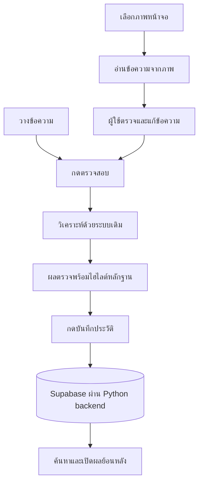

# แผนเพิ่ม 3 ฟีเจอร์ — Scam Checker

สถานะ: พัฒนาโค้ดทั้งสามฟีเจอร์แล้ว; เชื่อม Supabase รัน migration และยืนยันการบันทึกจริงแล้ว
วันที่: 4 ตุลาคม 2026

ขอบเขตตามชุดที่ผู้ใช้เลือก: ประวัติการตรวจสอบ → ไฮไลต์หลักฐานบนข้อความ → ตรวจจากภาพแชต/SMS
ระบบจัดเก็บตามที่ผู้ใช้กำหนด: Supabase Database (PostgreSQL) สำหรับประวัติถาวร
ลำดับพัฒนาแนะนำ: ประวัติ → ไฮไลต์ → ตรวจจากภาพ เพราะสองงานแรกสร้างหน้ารายงานที่ฟีเจอร์ภาพนำกลับมาใช้ได้

## 1. ขอบเขตและฐานจากโค้ดปัจจุบัน

- ใช้ Python backend และ HTML/CSS/JavaScript เดิมสำหรับเว็บที่เปิดบนเครื่องนี้
- `main.py::check_message()` คืนข้อความต้นฉบับ ผล AI, KB, VirusTotal และคะแนนรวมอยู่แล้ว
- `ai_scoring.py` ตรวจสอบหลักฐานที่ Gemini เลือก แล้วคืนข้อความอ้างอิงใน `risk_assessment` จึงต่อยอดไฮไลต์โดยไม่เรียก AI เพิ่มได้
- `web_server.py::JobStore` เก็บผลชั่วคราว 15 นาที สูงสุด 32 งาน และให้ทำงานตรวจทีละรายการ
- `web/app.js::renderReport()` ใช้เวลาตอนแสดงหน้าจอเป็นเวลาตรวจ ต้องเปลี่ยนไปใช้เวลาที่งานตรวจเสร็จก่อนรองรับประวัติ
- เว็บรับข้อความได้ 4,000 ตัวอักษร / 3 ลิงก์ และรับ JSON สูงสุด 32 KB การรับภาพต้องมีเส้นทางและเพดานขนาดแยก
- ประวัติถาวรเก็บใน Supabase บนคลาวด์ โดยเว็บเรียกผ่าน Python backend บนเครื่องนี้; งานตรวจชั่วคราวยังใช้หน่วยความจำและ TTL เดิม
- ประวัติรุ่นแรกเป็นประวัติร่วมของแอปที่เชื่อมกับ Supabase project นี้ ผู้ที่เข้าถึงเว็บ local เดียวกันเปิดดูได้ ไม่มีการแยกบัญชีผู้ใช้ในขอบเขตนี้

## 2. ประสบการณ์ใช้งานเป้าหมาย

แถบนำทางมี “ตรวจสอบ” และ “ประวัติ” ภายในหน้าตรวจสอบเลือก “ข้อความ” หรือ “ภาพหน้าจอ” ได้

การเลือกไฟล์แสดงภาพตัวอย่างในเบราว์เซอร์ก่อน ผู้ใช้กด “อ่านข้อความจากภาพ” จึงส่งภาพให้ Gemini ส่วนการส่งข้อความและลิงก์ไปวิเคราะห์เริ่มเมื่อกด “ตรวจสอบข้อความ” อีกครั้ง

## 3. ฟีเจอร์และเกณฑ์รับงาน

### 3.1 ประวัติการตรวจสอบ

**สิ่งที่ผู้ใช้ได้รับ**

- ปุ่ม “บันทึกผลนี้” หลังตรวจเสร็จ บันทึกเมื่อผู้ใช้เลือกเท่านั้น พร้อมระบุว่าข้อความและรายงานจะถูกเก็บใน Supabase บนคลาวด์
- หน้ารายการแสดงข้อความย่อ วันเวลา คะแนน ระดับความเสี่ยง และที่มาว่าเป็นข้อความหรือภาพ
- ค้นหาข้อความ กรองระดับความเสี่ยงและช่วงวันที่ เรียงใหม่ไปเก่า แบ่งหน้าครั้งละ 20 รายการ
- เปิดดูรายงานเดิม ทำเครื่องหมายรายการสำคัญ ลบรายรายการ และล้างประวัติพร้อมยืนยันในหน้าเว็บ
- ปุ่ม “นำข้อความมาตรวจใหม่” เติมข้อความกลับหน้าตรวจสอบ โดยยังต้องกดตรวจเอง
- ผลบางส่วนหรือยังประเมินไม่ได้บันทึกได้พร้อมสถานะที่ชัดเจน ไม่แปลงเป็นความเสี่ยงต่ำ

**แนวทางพัฒนา**

- เพิ่ม `history_store.py` เชื่อม Supabase Database ผ่าน Python SDK (`supabase`) และ Data API; หน้าเว็บติดต่อเฉพาะ `/api/history` ของ backend
- เก็บ SQL migration ใน `supabase/migrations/` ครอบคลุมตาราง constraints indexes และสิทธิ์เข้าถึง; บันทึกทุกการเปลี่ยน schema เป็น migration ที่ตรวจสอบย้อนหลังได้
- ตาราง `public.checks` เก็บ `id` ชนิด UUID, `job_id` ชนิด text แบบไม่ซ้ำ, `analyzed_at` และ `saved_at` ชนิด `timestamptz`, `source_type`, `input_text`, `risk_level`, `risk_score` ที่เป็น null ได้, `analysis_status`, `is_starred`, `report_version` และ `report_json` ชนิด `jsonb`
- เพิ่ม constraint ตรวจช่วงคะแนน 0–100 และค่าที่อนุญาตของสถานะ/ที่มาข้อมูล; เพิ่ม index ตามวันเวลาสำหรับเรียงรายการและตัวกรองที่ใช้จริง
- เก็บรายงานฉบับตอนตรวจเสร็จ รวมหลักฐานและ `scoring_method`; เปิดย้อนหลังจากข้อมูลนี้โดยไม่คำนวณคะแนนหรือเรียก API ใหม่
- ฝั่งเซิร์ฟเวอร์บันทึกจากงานที่ตรวจเสร็จจริงโดยรับ `job_id` ไม่รับคะแนนหรือรายงานที่เบราว์เซอร์ส่งมาเอง
- กดบันทึกซ้ำหรือส่งคำขอซ้ำต้องได้รายการเดิม: ใช้ unique constraint ของ `job_id` กับ insert แบบไม่เขียนทับเมื่อซ้ำ แล้วอ่านรายการเดิมกลับมา; ห้าม upsert ทับรายงานหรือสถานะรายการสำคัญ การกดตรวจใหม่จึงสร้างผลใหม่
- ตั้ง timeout และ retry แบบมีเพดานสำหรับ Data API; รองรับคำขอจาก `ThreadingHTTPServer` โดยไม่แชร์ request builder หรือเปลี่ยน auth state ของ client ระหว่างเธรด
- เพิ่ม `SUPABASE_URL` และ `SUPABASE_SECRET_KEY` ใน `config.py` และตัวอย่างที่ไม่มีค่าจริงใน `.env.example`; ค่าจริงเก็บใน `.env` ฝั่ง backend ที่ถูก ignore อยู่แล้ว ไม่ส่งออกผ่าน HTML, JavaScript, API หรือ log
- เปิด Row Level Security (RLS) บน `public.checks` และถอนสิทธิ์ตารางจาก `anon`/`authenticated` ในรุ่นที่ไม่มี login; ให้บทบาท `service_role` มีสิทธิ์ CRUD ที่จำเป็น และไม่สร้าง policy ที่เปิดประวัติให้สาธารณะ
- Secret key ใช้สิทธิ์ `service_role` ซึ่งข้าม RLS ดังนั้น backend ต้องตรวจคำขอเองตาม Host/Origin guards เดิม; RLS ไม่ได้แยกประวัติรายบุคคลให้การเรียกด้วย key นี้
- ปรับข้อความเรื่องการส่งและเก็บข้อมูลในหน้าเว็บและ README ให้ระบุ Supabase; ภาพต้นฉบับยังไม่บันทึก และไม่ต้องสร้าง Supabase Storage bucket
- หากยังไม่ตั้งค่า Supabase หรือเชื่อมต่อไม่ได้ การตรวจข้อความและอ่านผลชั่วคราวยังทำงานได้ แต่หน้าประวัติ/ปุ่มบันทึกต้องแจ้งสถานะจริง
- หากคำขอบันทึก timeout หลังส่งแล้ว ให้ตรวจรายการจาก `job_id` ก่อนลองใหม่ ไม่สรุปว่าไม่มีข้อมูล; หากยังยืนยันไม่ได้ให้แจ้ง “ยังยืนยันการบันทึกไม่ได้” ส่วนงานที่หมดอายุให้แจ้งตรง ๆ ว่าบันทึกไม่ได้แล้ว

แนวทางสิทธิ์และคีย์อ้างอิง [Supabase API keys](https://supabase.com/docs/guides/getting-started/api-keys) และ [RLS](https://supabase.com/docs/guides/database/postgres/row-level-security); การเชื่อมใช้ [Python SDK](https://supabase.com/docs/reference/python/initializing) และ [SQL migrations](https://supabase.com/docs/guides/deployment/database-migrations)

**ถือว่าเสร็จเมื่อ**

- ปิดและเปิดเซิร์ฟเวอร์ใหม่แล้วยังดูรายการที่บันทึกได้ ส่วนรายการที่ไม่ได้เลือกบันทึกไม่ลงฐานข้อมูล
- เปิดประวัติแล้วเวลา คะแนน หลักฐาน และสถานะตรงกับตอนตรวจจริง และไม่เรียก Gemini/VirusTotal
- ค้นหา กรอง ทำรายการสำคัญ และลบได้จริง; การลบหรือบันทึกล้มเหลวไม่แสดงผลสำเร็จหลอก
- คำค้นและ Secret key ไม่ถูกเขียนลง log หรือส่งให้เบราว์เซอร์; เรียกตารางผ่าน publishable key/บทบาทที่ไม่มีสิทธิ์แล้วอ่านหรือแก้ประวัติไม่ได้
- Supabase timeout ระหว่างบันทึกและลองใหม่ไม่ทำรายการซ้ำ; เชื่อมต่อไม่ได้ต้องแสดงข้อผิดพลาดแยกจาก “ยังไม่มีประวัติ”

### 3.2 ไฮไลต์หลักฐานบนข้อความ

**สิ่งที่ผู้ใช้ได้รับ**

- การ์ด “จุดที่ใช้ประกอบการประเมิน” แสดงข้อความต้นฉบับพร้อมไฮไลต์
- แยกหมวดตามข้อมูลที่มี: ขอข้อมูล/เงินหรือข่มขู่, หลอกอ้าง, กดดัน และลิงก์น่าสงสัย
- แตะหรือใช้คีย์บอร์ดเลือกส่วนที่ไฮไลต์เพื่ออ่านเหตุผลและระดับหลักฐาน ใช้ป้ายข้อความร่วมกับสี
- เปิด/ปิดไฮไลต์ได้ และยังเปิดอ่านรายละเอียดหลักฐานแบบเดิมได้

**แนวทางพัฒนา**

- เพิ่ม `evidence_highlights.py` สร้างส่วนข้อความสำหรับแสดงผลจาก `input_text` และหลักฐาน AI ที่ผ่านการตรวจสอบแล้ว เฉพาะหมวดที่มีระดับมากกว่า 0
- คืน `segments` แต่ละส่วนมีข้อความต้นฉบับกับรหัสหลักฐานที่เกี่ยวข้อง; เมื่อนำข้อความทุกส่วนมาต่อกันต้องได้ `input_text` เดิมทุกตัวอักษร
- วิธีส่งส่วนข้อความช่วยหลีกเลี่ยงปัญหาตำแหน่งอีโมจิที่ Python และ JavaScript นับต่างกัน รวมทั้งจัดการหลายหมวดที่ซ้อนทับกันได้
- จับคู่ตรงตัวเท่านั้น ไม่สร้างประโยคอ้างอิงหรือเดาตำแหน่งด้วย AI อีกครั้ง
- ถ้าข้อความอ้างอิงซ้ำหลายแห่ง แสดงทุกแห่งที่ตรงพร้อมระบุว่าเป็นข้อความซ้ำ ไม่อ้างว่าโมเดลเลือกตำแหน่งใดโดยเฉพาะ เพราะ catalog เดิมรวมข้อความซ้ำไว้ด้วยกัน
- ถ้า AI อ้างทั้งข้อความ ให้แสดงตามขอบเขตนั้น ไม่ย่อหลักฐานเองเป็นคำที่ดูเสี่ยงกว่า
- URL ที่ถูกแปลงจาก `hxxp` หรือ `[.]` อาจไม่ตรงต้นฉบับ: คงรายละเอียดไว้ในการ์ดลิงก์และระบุว่าไม่สามารถผูกตำแหน่งตรงตัวได้ในรุ่นแรก
- ถ้าไม่มีหลักฐานหรือ AI ไม่พร้อม แสดงข้อความต้นฉบับและสถานะตามจริง ไม่ใช้คำที่ KB จับได้แทนหลักฐาน AI
- เพิ่มข้อมูลประกอบรายงานแบบ optional โดยไม่เปลี่ยนสูตรคะแนน; ประวัติรุ่นเก่าสร้างไฮไลต์ได้จากข้อความและหลักฐานที่บันทึกไว้เท่านั้น
- สร้าง DOM ด้วย text nodes/`textContent` ไม่แทรกข้อความผู้ใช้หรือ AI เป็น HTML; ลิงก์ในหลักฐานยังเป็นข้อความธรรมดา

**ถือว่าเสร็จเมื่อ**

- ไฮไลต์ทุกจุดอ้างกลับไปยังหลักฐานในรายงานได้ และการเปิดไฮไลต์ไม่เพิ่มการเรียก AI
- ภาษาไทย สระ/วรรณยุกต์ อีโมจิ บรรทัดใหม่ หลักฐานซ้ำและซ้อนทับ ไม่ทำให้ข้อความหายหรือผิดตำแหน่ง
- มือถือและคีย์บอร์ดเปิดเหตุผลได้ และข้อความที่มี HTML/script แสดงเป็นข้อความธรรมดา

### 3.3 ตรวจจากภาพแชต / SMS

**สิ่งที่ผู้ใช้ได้รับ**

- เลือกหรือลากภาพ PNG, JPEG หรือ WebP แบบภาพนิ่งเข้าหน้าเว็บ ครั้งละ 1 ภาพ
- ค่าเริ่มต้นที่เสนอ: ขนาดไฟล์ไม่เกิน 5 MiB และภาพไม่เกิน 16 ล้านพิกเซล
- แสดงภาพตัวอย่างและปุ่มลบ/เปลี่ยนภาพ พร้อมข้อความว่าการอ่านข้อความจะส่งภาพให้ Gemini
- แสดงข้อความที่อ่านได้ในช่องแก้ไข ให้ตรวจทานโดยเฉพาะ URL ตัวเลข และส่วนที่อ่านไม่ชัด
- หลังตรวจแก้แล้วใช้ปุ่มตรวจสอบเดิม ได้รายงาน ไฮไลต์ และการบันทึกประวัติชุดเดียวกัน
- ข้อความเกิน 4,000 ตัวอักษรหรือมีเกิน 3 ลิงก์ให้ผู้ใช้เลือกแก้/แบ่งข้อความ ไม่ตัดทิ้งเงียบ ๆ

**แนวทางพัฒนา**

- เพิ่ม `image_reader.py` สำหรับอ่านและตรวจชนิดภาพจริงด้วย Pillow รวมถึงหมุนตาม orientation และลบ metadata เมื่อเตรียมภาพส่ง
- ปฏิเสธไฟล์เสีย ชนิดที่ไม่รองรับ ภาพเคลื่อนไหว และภาพเกินเพดาน ก่อนเรียกบริการภายนอก
- เพิ่ม `ocr_analyzer.py` ใช้ Gemini ผ่าน `google-genai` ที่มีอยู่ โดยรับภาพเป็น inline bytes; ตรวจความเข้ากันได้ของ SDK และโมเดลที่ตั้งค่าไว้ก่อนเชื่อมจริง
- ผลการอ่านข้อความเป็น schema แยก เช่น `text`, `warnings`; คำเตือนจากโมเดลเป็นเพียงข้อสังเกต ไม่ใช่คะแนนความแม่นยำที่วัดได้
- prompt ให้ถอดข้อความตามภาพ รักษาบรรทัดและผู้พูดเมื่ออ่านได้ ไม่เติม URL ที่ขาด และถือคำสั่งในภาพเป็นเนื้อหาที่ต้องอ่าน
- ขั้นอ่านข้อความยังไม่ส่ง URL ให้ VirusTotal และยังไม่ตัดสินความเสี่ยง การวิเคราะห์ใช้เฉพาะข้อความที่ผู้ใช้ตรวจแก้และยืนยันแล้ว
- ภาพจาก browser ส่งเป็น bytes ไปยัง endpoint เฉพาะ; ไม่ใช้ JSON base64 ระหว่าง browser กับ backend และไม่เปิดรับ URL รูปภาพภายนอกในรุ่นนี้
- ขยาย JobStore ให้รองรับชนิดงาน `check` กับ `ocr` และใช้ตัวจำกัดงานร่วมกันทีละงาน ป้องกันการกดซ้ำใช้โควตาพร้อมกัน
- เก็บ job ID ของ OCR แยกจากงานตรวจ เพื่อกลับมาติดตามงานเดิมได้เมื่อเครือข่ายสะดุด; การ polling ไม่เริ่ม OCR ใหม่
- กำหนด timeout และจำนวน retry แบบมีเพดาน; งานผิดพลาดคืน slot เสมอ และแจ้งภาษาไทยโดยไม่เปิดเผย provider response
- ภาพอยู่ในหน่วยความจำของแอปเฉพาะช่วงประมวลผลแล้วปล่อยทิ้ง ไม่บันทึกภาพลงประวัติหรือไฟล์ชั่วคราว; ผล OCR ใช้ TTL เดียวกับงานชั่วคราว
- การไม่เก็บภาพเป็นพฤติกรรมของแอปนี้ ไม่อ้างว่าเป็นนโยบายการเก็บข้อมูลของผู้ให้บริการ Gemini
- ใช้ Blob URL สำหรับภาพตัวอย่างและ revoke เมื่อเปลี่ยน/ลบภาพ; ปรับ CSP เฉพาะ `img-src` ให้ใช้ `blob:` ได้
- ประวัติเก็บข้อความฉบับที่ผู้ใช้ตรวจแก้ พร้อม `source_type=image` ไม่เก็บภาพหรือข้อความ OCR ฉบับก่อนแก้ซ้ำอีกชุด
- เพิ่ม Pillow ใน `requirements.txt`; รองรับ `GEMINI_OCR_MODEL` หากต้องแยกโมเดลอ่านภาพจากโมเดลวิเคราะห์

**ถือว่าเสร็จเมื่อ**

- เส้นทางภาพ → ข้อความที่แก้ได้ → ผลตรวจ → ไฮไลต์ → บันทึก → เปิดย้อนหลัง ทำงานครบ
- เปลี่ยนข้อความหรือเปลี่ยนภาพแล้วสถานะรายงานและที่มาของข้อมูลไม่ค้างจากงานก่อน
- ภาพเบลอ ภาพไม่มีข้อความ ไฟล์เสีย เกินขนาด และ API ล้มเหลวให้ข้อผิดพลาดชัดเจน ไม่มีคะแนนสำรองที่อ้างว่าอ่านภาพสำเร็จ
- ใช้ภาพตัวอย่างสังเคราะห์ที่มีข้อความอ้างอิงเพื่อตรวจคุณภาพ OCR โดยเฉพาะ URL; ถ้าคุณภาพยังไม่พอให้ปรับภาพ/โมเดลก่อนรับงาน ไม่อ้างความแม่นยำจากเดโมไม่กี่ภาพ

## 4. API และจุดแก้ไขร่วม

| API | หน้าที่ |
|---|---|
| `POST /api/check` | รับ `message` และ `source_type` ที่ตรวจค่าแล้ว; ยังคงเริ่มงานวิเคราะห์เดิม |
| `GET /api/jobs/{id}` | เพิ่ม `kind`, เวลาตรวจเสร็จ และผลตามชนิดงาน; frontend ต้องแยกผล OCR กับรายงาน |
| `POST /api/history` | รับ `job_id` ของงานตรวจที่เสร็จแล้วเพื่อบันทึก; ไม่รับผล OCR เป็นรายงาน |
| `GET /api/history` | รายการย่อพร้อมตัวกรองคำค้น/ระดับ/วันที่/รายการสำคัญและการแบ่งหน้า |
| `GET /api/history/{id}` | รายงานฉบับที่บันทึกไว้ |
| `PATCH /api/history/{id}` | เปลี่ยนสถานะรายการสำคัญ |
| `DELETE /api/history/{id}` | ลบหนึ่งรายการ |
| `DELETE /api/history` | ล้างทั้งหมดหลังผู้ใช้ยืนยันจาก UI |
| `POST /api/ocr` | รับ image bytes ตาม MIME ที่อนุญาต คืน `202` และ job ID |

- ทุกเส้นทางใหม่ใช้ Host/Origin checks เดียวกับระบบเดิม รวม PATCH/DELETE และคง `Cache-Control: no-store`
- query ผ่าน Supabase SDK ใช้ตัวกรองที่ตรวจค่าและชื่อคอลัมน์ที่กำหนดไว้; คำค้นใช้ substring matching ที่รองรับภาษาไทย พร้อมจัดการ wildcard เป็นข้อความ ไม่ต่อคำค้นเข้า raw SQL หรือ raw PostgREST filter; access log ไม่บันทึก query string ที่มีคำค้น
- รายการประวัติเลือกเฉพาะคอลัมน์สรุปและแบ่งหน้าฝั่งฐานข้อมูล โหลด `report_json` เมื่อเปิดรายละเอียดเท่านั้น; การล้างประวัติลบเฉพาะข้อมูลในตาราง `checks` ไม่กระทบตารางอื่นของ Supabase project
- เพิ่ม `supabase` ใน `requirements.txt` เมื่อเริ่ม implementation และทดสอบเวอร์ชันร่วมกับ dependencies เดิม; `/api/status` ส่งเฉพาะสถานะการตั้งค่าที่ใช้แสดง UI ไม่มีค่า key
- เก็บเวลา UTC และแสดงเวลาท้องถิ่นบนเว็บ; แปลงตัวกรองวันที่ให้ตรงวันของผู้ใช้และทดสอบกรณีข้ามเที่ยงคืน
- API ภาพมีเพดาน body ของตัวเอง ขณะที่ `/api/check` ยังใช้เพดาน JSON เดิม
- แยก state ของภาพ, OCR, ข้อความฉบับร่าง, งานตรวจ และรายงานที่แสดงอยู่ เพื่อป้องกันผลเก่าถูกแสดงว่าเป็นของข้อความที่แก้แล้ว
- `renderReport()` รับรายงานและ metadata ทั้งจากงานใหม่กับประวัติ และไม่เขียนทับร่างที่ผู้ใช้กำลังแก้โดยไม่ตั้งใจ
- เครื่องมือ browser agent ที่มีอยู่ยังใช้เส้นทางข้อความเดิม; การตรวจผ่านเครื่องมือนี้ไม่บันทึกประวัติอัตโนมัติ

## 5. ลำดับส่งมอบและการตรวจงาน

| ช่วง | งานหลัก | จุดตรวจรับ |
|---|---|---|
| A — ประวัติ | เพิ่มเวลา/เวอร์ชันรายงาน → Supabase migrations/สิทธิ์ → Python SDK และ API → ปุ่มบันทึก/หน้าประวัติ | เปิดใหม่แล้วยังมีข้อมูล เปิดผลโดยไม่เรียก AI และลบได้ |
| B — ไฮไลต์ | จับคู่หลักฐาน → ส่วนข้อความที่จัดการการซ้อนทับ → UI เหตุผลบนมือถือ/คีย์บอร์ด | ทุกไฮไลต์มีที่มาและข้อความต้นฉบับครบ |
| C — ภาพ | ตรวจไฟล์ → งาน OCR → หน้า preview/แก้ไขข้อความ → เชื่อมรายงาน/ประวัติ | เส้นทางภาพครบและไม่ใช้ผล OCR ที่ยังไม่ได้ยืนยัน |
| D — รวมระบบ | ทดสอบเส้นทางร่วม → ตรวจหน้าจอ desktop/mobile → อัปเดต README | พร้อมเดโมด้วยข้อความและภาพสังเคราะห์ |

ชุดทดสอบที่เพิ่มตามพฤติกรรม: `test_history_store.py`, `test_history_api.py`, `test_evidence_highlights.py`, `test_image_reader.py`, `test_ocr_analyzer.py` และขยาย `test_web_server.py`

ใช้ mock Gemini/VirusTotal และ Supabase client ใน unit tests เพื่อทดสอบข้อผิดพลาดและการนับคำขอได้แน่นอน เพิ่ม integration tests กับ Supabase test project หรือ local Supabase สำหรับ migration, grants/RLS, CRUD, unique constraint และกรณีคำขอชนกัน โดยใช้ข้อมูลสังเคราะห์และแยกจากข้อมูลใช้งานจริง รัน tests เดิมเพื่อตรวจว่า parser การให้คะแนน และรูปแบบผลเดิมยังทำงาน หลังจากนั้นตรวจ OCR จริงด้วยตัวอย่างสังเคราะห์เมื่อพร้อมใช้ API พร้อมตรวจหน้าเว็บทั้งมือถือและ desktop

สถานการณ์รวมที่ต้องผ่าน: บันทึกซ้ำไม่เพิ่มรายการ, ผลบางส่วนยังเปิดได้, DB เขียนไม่ได้แต่ผลตรวจยังอยู่, OCR กับการตรวจไม่รันพร้อมกัน, refresh/เครือข่ายสะดุดติดตามงานเดิม, เปิดประวัติระหว่างมีร่างไม่ทำร่างหาย และการแก้ข้อความจากภาพส่งข้อความฉบับล่าสุดจริง

## 6. ต้นทุนและข้อจำกัดที่มีผลกับแผน

- ประวัติและไฮไลต์ใช้ข้อมูลผลตรวจเดิม จึงไม่ต้องเรียก Gemini เพิ่ม
- การบันทึกและอ่านประวัติต้องเชื่อมต่อ Supabase; การใช้ฐานข้อมูลและปริมาณรับส่งข้อมูลขึ้นกับแผนบริการของ project ที่เลือก ตรวจโควตาจริงตอนตั้งค่า
- เส้นทางภาพเพิ่มการเรียกอ่านข้อความก่อนการวิเคราะห์ ค่าใช้จ่ายและเวลาขึ้นกับโมเดล ขนาดภาพ และการ retry; ไม่ใส่ตัวเลขประมาณการก่อนทดสอบโมเดลที่ใช้งานจริง
- รุ่นแรกเน้นถอดข้อความจากภาพแชต/SMS การตรวจ QR, การตัดสินสลิปจริง/ปลอม และการวิเคราะห์ภาพประกอบที่ไม่มีข้อความเป็นงานแยก
- ก่อนเปิดเว็บให้หลายคนผ่านอินเทอร์เน็ต เพิ่ม Supabase Auth, `user_id` และ policy ผูกเจ้าของข้อมูล พร้อมให้การเรียกอ่าน/แก้ประวัติใช้ JWT ของผู้ใช้ที่ผ่านการตรวจสอบเพื่อให้ RLS ทำงาน; ไม่ใช้ Secret key แทนการตรวจเจ้าของข้อมูล

สิ่งที่ต้องเตรียมเมื่อเริ่มเชื่อมจริง: Supabase project สำหรับแอป, Project URL และ Secret key ที่ตั้งใน `.env` ฝั่ง backend รวมถึง test project สำหรับยืนยัน migration และสิทธิ์ ดูขั้นตอนใน `supabase/SETUP.md` ไม่ต้องนำคีย์มาใส่ในแชต

เอกสารประกอบการเชื่อมภาพ: [Gemini image understanding](https://ai.google.dev/gemini-api/docs/image-understanding) และ [Generate Content image input](https://ai.google.dev/gemini-api/docs/generate-content/image-understanding) รองรับการส่งภาพแบบ inline; implementation ต้องตรวจโมเดลและ SDK ที่ติดตั้งจริงอีกครั้ง

## ผลส่งมอบวันที่ 4 ตุลาคม 2026

- เพิ่มระบบประวัติผ่าน Supabase SDK พร้อม migration, RLS/grants, การค้นหาผ่าน typed RPC และการบันทึกซ้ำแบบไม่เขียนทับผลเดิม
- เพิ่มไฮไลต์จากหลักฐานเดิมบนหน้าผลและรายงานในประวัติ พร้อมเหตุผลและการรองรับข้อความซ้ำ/ซ้อนทับ
- เพิ่มอัปโหลดภาพ อ่านผ่าน Gemini ตรวจแก้ก่อนวิเคราะห์ และติดตามงาน OCR เดิมหลัง refresh
- Python tests ชุดเดิม: 149 ผ่าน / 1 ข้าม; ต่อมารัน integration test กับ Supabase จริงผ่านเพิ่ม 1 รายการ
- Browser tests: desktop/mobile ผ่านเส้นทางรายงาน ไฮไลต์ บันทึก ค้นหา รายการสำคัญ ประวัติไม่เรียก AI ซ้ำ รักษาร่าง OCR หลัง refresh ตรวจข้อความฉบับแก้ และล้างประวัติ
- OCR จริงกับ `tests/fixtures/ocr_sms.png`: อ่านภาษาไทย/OTP, URL และเวลาได้ตามภาพสังเคราะห์ เป็นการตรวจตัวอย่างหนึ่งภาพ ไม่ใช่ค่าความแม่นยำทั่วไป
- สร้าง Organization และโปรเจกต์ Scam Checker แผน Free รัน migration สำเร็จ และตั้งค่า URL/Secret key เฉพาะใน `.env` ฝั่ง backend
- Integration test กับ Supabase จริงผ่าน: บันทึก/บันทึกซ้ำ เปิดรายงาน ค้นหาข้อความตรงตัว ทำรายการสำคัญ ลบรายการทดสอบ และยืนยันว่า publishable key อ่านตารางหรือเรียกฟังก์ชันค้นหาไม่ได้
- ยืนยันผ่าน API ของแอปและหน้าประวัติจริงว่าบันทึกและเปิดรายงานได้ รวมถึงเปิดรายงานเดิมหลังปิดและเปิดเซิร์ฟเวอร์ใหม่; ลบเฉพาะข้อมูลสังเคราะห์ที่ใช้ทดสอบแล้ว
